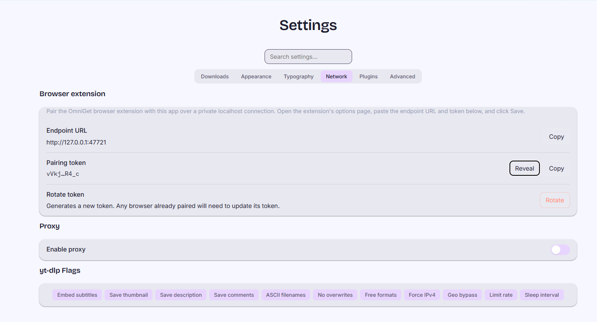
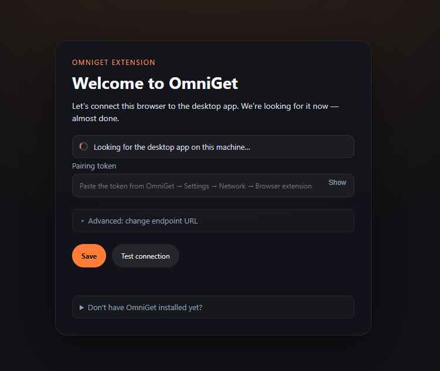
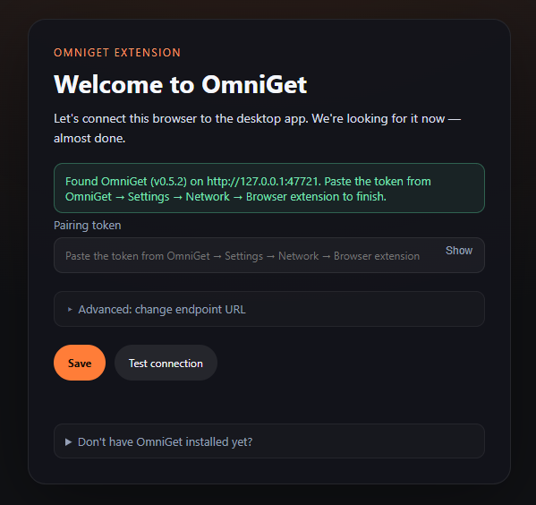
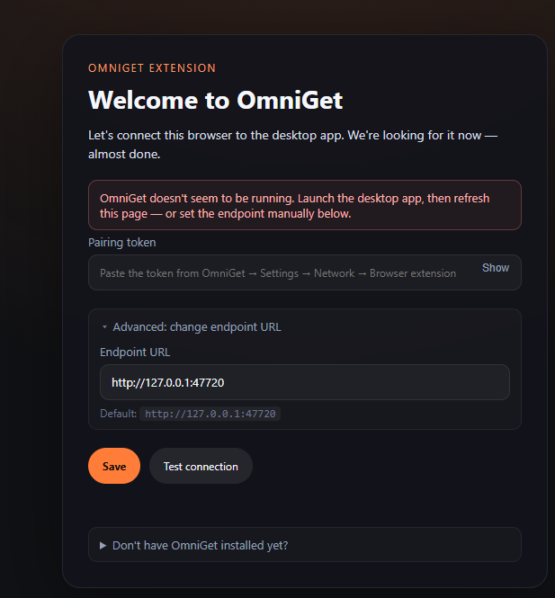
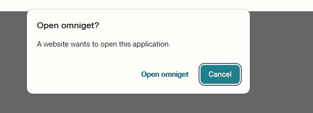

# OmniGet Chrome Extension

Detects video and audio streams on any website and sends them to the OmniGet desktop app for download — with cookies, referer, and auth headers included.

## Features

- Detects MP4, HLS (M3U8), DASH (MPD), WebM, and audio streams in real time via `webRequest`
- Groups HLS manifests into logical video sessions — no duplicate entries
- Filters out HLS `.ts` segments and subtitle manifests automatically
- Sends cookies, referer, and authorization headers for authenticated downloads
- Recognizes 13 platforms by URL (YouTube, Instagram, TikTok, etc.) and activates the icon
- Media detection works on **all websites**, not just recognized platforms
- Dark-themed popup with quick download, batch download, and per-video controls
- Sniffer toggle persisted across sessions

## How It Works

### On known platforms

When you visit YouTube, Instagram, TikTok, or any of the 13 recognized platforms, the toolbar icon switches from gray to colored. Open the popup and click the download button — the page URL, cookies, and platform info are POSTed to the OmniGet desktop app over an authenticated localhost HTTP bridge (or fall through to the `omniget://` deep link if the bridge isn't paired).

### On any website (media detection)

The extension monitors network requests for video and audio streams as pages load them. Detected media appears in the popup grouped by video session. Click the download button on any entry, or use batch download to send all detected videos at once. Each download includes the page's cookies and referer for authenticated content.

### Pairing the localhost bridge

The desktop app starts a local HTTP server on `127.0.0.1:<port>` (default `47720`, range `47720..47729`, falls back to an OS-picked port if all are taken). On first launch it generates a per-installation token. The extension's options page opens automatically on install/update, **probes the local port range to auto-detect the endpoint**, and asks you to paste only the token from **OmniGet → Settings → Network → Browser extension**. After pairing, every download reaches the app authenticated with `Authorization: Bearer <token>` — no extension ID involved, so the same app works with any browser, any extension build, and any Chromium fork.

The endpoint URL is hidden behind an "Advanced" disclosure for the rare case where the desktop app runs on a different host. If auto-discovery fails (app not running, port out of range), the disclosure opens automatically so you can set the URL by hand.

## Screenshots

### Where the token comes from

OmniGet → Settings → Network → Browser extension. Copy the masked token; the URL is auto-detected by the extension so you don't have to.



### Pairing flow on the extension side

| State | Screenshot |
|---|---|
| **Discovering** the local bridge — first second on a fresh install. |  |
| **Found.** Endpoint pre-filled, only the token field is visible. |  |
| **Saved.** Token persisted in `chrome.storage.local`, ready for downloads. |  |
| **App not running.** Discovery banner turns red and the Advanced URL field opens automatically so you can override. |  |

### `omniget://` fallback when the bridge isn't paired

If the user clicks Download before completing the pairing flow, the extension falls back to the `omniget://` URL scheme. Chrome shows its standard external-protocol prompt the first time; tick "Always allow" to skip it on subsequent clicks.



## Supported Platforms

| Platform | Content types |
|----------|--------------|
| YouTube | video, short, playlist, profile |
| Instagram | post, reel, story, profile |
| TikTok | video (direct, short link, embed), profile |
| Twitter / X | post, profile |
| Reddit | post, video, profile |
| Twitch | video, clip, live stream |
| Hotmart | course |
| Pinterest | pin (image) |
| Bluesky | post, profile |
| Telegram | post, profile |
| Vimeo | video |
| Udemy | course |
| Bilibili | video |

Mirror domains are also recognized: `youtu.be`, `youtube-nocookie.com`, `ddinstagram.com`, `vxtwitter.com`, `fixvx.com`, `v.redd.it`, `redd.it`, `clips.twitch.tv`, `pin.it`, `b23.tv`, `t.me`, `telegram.me`.

## Install

1. Install the OmniGet desktop app and launch it once (it generates a pairing token and starts the local bridge).
2. Open `chrome://extensions`, enable **Developer mode**, click **Load unpacked**, select `browser-extension/chrome/`.
3. The extension's onboarding tab opens automatically. The endpoint is auto-detected; just copy the token from **OmniGet → Settings → Network → Browser extension** (Copy button), paste it in the **Pairing token** field, and click **Save**.
4. Click the OmniGet icon on any page.

If the bridge isn't paired (or the app is closed), clicks fall back to the `omniget://` URL scheme, which still queues the URL but won't carry cookies.

## Permissions

| Permission | Why |
|------------|-----|
| `webRequest` | Detect video/audio streams in network traffic |
| `cookies` | Forward session cookies for authenticated downloads |
| `storage` | Remember sniffer on/off preference and the bridge pairing token |
| `tabs` | Read page URL and title for context |
| `host_permissions: http://127.0.0.1/*` | POST to the desktop app's local bridge |
| `host_permissions: *://*/*` (optional) | Monitor requests on all sites for media detection |

## Architecture

```
popup/
  popup.html           Popup shell (header + dynamic content area)
  popup.css            Dark theme, animations, state-based styles
  popup.js             State machine UI: known platform / media detected / listening / paused
src/
  background.js        Service worker: icon switching, bridge fetch, message routing
  bridge-client.js     Localhost HTTP client: load/save token, health check, port discovery
  send-via-scheme.js   omniget:// fallback: hidden tab launches the OS handler
  media-sniffer.js     webRequest listener: detects media streams, filters .ts segments
  sniffer-toggle.js    Persists sniffer on/off state via chrome.storage.local
  detect.js            URL-based platform detection (no content scripts)
  cookies.js           Cookie extraction for authenticated platforms
  action-feedback.js   Badge controller (green checkmark for 1.5s)
  action-title.js      Tooltip resolution with i18n fallback
  action-click.js      Click handler with DI for testability
pages/
  options.html/css/js  Pairing onboarding: welcome state, auto-discovery, token paste
  error.html/css/js    Standalone error page (HOST_MISSING, INVALID_URL, LAUNCH_FAILED)
  error-content.js     Error message resolution with i18n fallback
scripts/
  package.mjs          ZIP packaging for CWS (strips manifest key)
tests/
  *.test.mjs           196 tests across 9 files
```

## Packaging

```bash
node browser-extension/chrome/scripts/package.mjs --version 0.2.0 --output omniget-chrome-extension.zip
```

The packaging script strips the `key` field from `manifest.json` before creating the ZIP. The extension ID is no longer load-bearing on the desktop side — auth flows through the bridge token, so any CWS / unpacked / sideloaded build pairs with the same app instance.

## Tests

```bash
node --test browser-extension/chrome/tests/*.test.mjs
```

196 tests across 9 files covering platform detection, click handling, badge feedback, tooltip titles, error content, cookie extraction, manifest validation, the omniget:// scheme builder + hidden-tab fallback, and the localhost bridge client (config IO, health probe, port discovery, fetch with timeout / 401 / network failure paths).

## Internationalization

8 languages: English, French, Portuguese, Greek, Italian, Japanese, Simplified Chinese, Traditional Chinese.

Locale files are in `_locales/{lang}/messages.json`. Error pages and tooltip titles fall back to English when a translation is missing.
